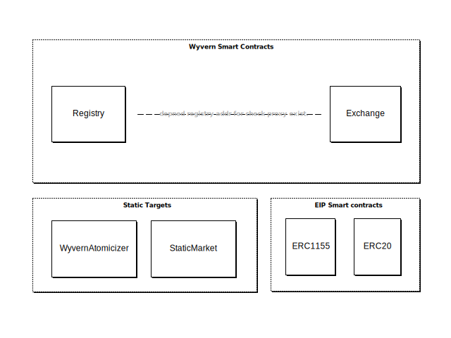

# Wyvern Protocol

<!-- Wyvern 是一种数字资产交易协议，主要为了数字资产提供了一对一的交换能力。比如，我们可以用于 进行 NFT 和任何代币进行交易，或者用于代币与代币之间的兑换交易。Wyvern 有以下三点特性：

- 支持交易任何不可更改的资产，无论是 ERC20/ERC1155/ERC721；
- 支持所有的 EVM 平台部署，并为开发者提供 EVM 平台上资产交换的能力；
- 大大节省用户进行交易时产生的 Gas 费用；
- 开源； -->

Wyvern is a first-order decentralized exchange protocol. Comparable existing protocols such as Etherdelta, 0x, and Dexy are zeroeth-order: each order specifies a desired trade of two discrete assets (generally two tokens in a particular ratio and a maximum amount). Wyvern orders instead specify predicates over state transitions: an order is a function mapping a call made by the maker, a call made by the counterparty, and order metadata to a boolean (whether or not the order will match). These predicates are arbitrary - any asset or any combination of assets representable on Ethereum can be exchanged with a Wyvern order - and indeed, Wyvern can instantiate all the aforementioned protocols.

> Wyvern 是一阶去中心化交换协议。类似的现有协议，如 Etherdelta、0x 和 Dexy 是零阶的：每个订单都指定了两个离散资产的所需交易（通常是特定比率和最大数量的两个代币）。 Wyvern 订单改为指定状态转换的谓词：订单是一个函数，将制造商的调用、交易对手的调用以及订单元数据映射到布尔值（订单是否匹配）。这些谓词是任意的——以太坊上可表示的任何资产或资产的任何组合都可以与 Wyvern 订单进行交换——事实上，Wyvern 可以实例化所有上述协议。

## 协议描述

Wyvern 协议由四个模块组成：

- `Registry`: 代理注册器， 用于保存已被注册的代理对象；
- `Exchange`: 数字资产交换器，用于执行交易请求，变更订单状态等业务逻辑；
- `Static Targets`: 提供一些工具和静态函数，用于变更交易后的订单状态和交易最终一致性验证；
- `EIP Smart contracts`: 该模块不是必须的，它主要是与注册代理时的代理协议有关，比如代理 ERC20 的钱包地址时则需要给出 ERC20 合约的地址；

### Registry

Wyvern 协议中给出一个规则：

使用 Wyvern 协议的交易双方需要将对应的交易权限交由 Wyvern，再由 Wyvern 去执行对应的交易操作（比如代币转账）。

