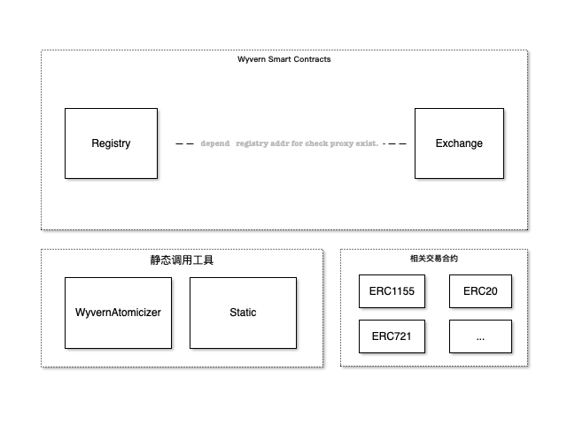
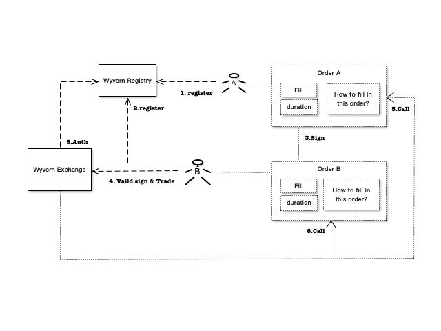
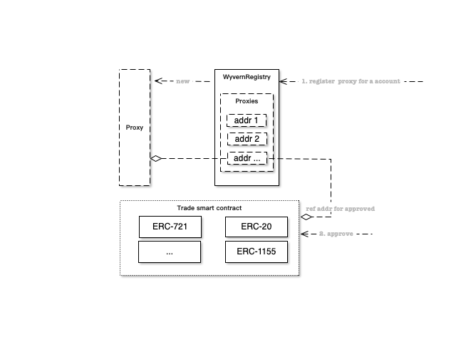

# Wyvern Protocol

Wyvern 是一种数字资产交易协议，主要为了数字资产提供了一对一的交换能力。比如，我们可以用于 进行 NFT 和任何代币进行交易，或者用于代币与代币之间的兑换交易。Wyvern 有以下三点特性：

- 支持交易任何不可更改的资产，无论是 ERC20/ERC1155/ERC721；
- 支持所有的 EVM 平台部署，并为开发者提供 EVM 平台上资产交换的能力；
- 大大节省用户进行交易时产生的 Gas 费用；
- 开源;

## 协议描述

Wyvern 合约可以归纳为 *Exchange* && *Registry* && *静态调用工具* && *相关交易合约* 四个部分。



- Exchange - 交换器：用于提供 Order 状态变更，交易执行流程等业务逻辑的实现；
- Registry - 注册器：用于提供 Proxy 的注册，执行代理合约；
- 静态调用工具：提供了批量事务性操作工具，Order 状态变更逻辑；
- 相关交易合约：这部分需要根据交易场景来进行选择，比如如果需要 ERC-20 的场景，则需要 ERC-20 合约的参与；

### 订单

Wyvern 协议中提出了 *Order* 模型的概念，该模型包含以下信息：

|Name | Type |	Purpose|
|--|--|--|
|registry|	address |	注册器的地址 - 交易所，所有的交易双方都需要在交易所注册登记，才会被认为是合法的。
|maker |	address |	订单所有者 - 交易方，用于证明该 *Order* 所有权属于谁。
|staticTarget |	address |	调用地址 - 处理交易的地点。
|staticSelector |	bytes4 | 交易过程 - 处理交易的业务逻辑，比如改变 *Order* 状态。
|staticExtradata |	bytes |	交易时所需的数据。
|maximumFill |	uint256	| *Order* 包含的物品数量，也可以特指交易金额。
|listingTime |	uint256	| 上架时间，如果 > 交易时间，则不允许交易。
|expirationTime |	uint256	| 下架时间，如果 <= 交易时间，则不允许交易
|salt |	uint256	| 生成签名所需的 *salt*

### 协议交互过程

Wyvern 协议类似于一个交易所，它可以交易任何物品。



按照一个房屋委托租凭流程来描述 Wyvern 整个协议的交互。

1. 甲方（A）来到中介所在地（Wyvern Registry），希望 Wyvern 能够帮他把手里的两套房租出去。Wyvern 让甲方（A）先登记。Wyvern 让甲方（A）把两套房屋的钥匙交给他们保管（授权 NFT 转移权限），并给甲方（A）填写了一份表格（Order A）。该表格里包含了租凭房屋的数量、什么时候开始、什么时候到期、房屋租用的手续该怎么执行。
2. 乙方（B）来到中介所在地（Wyvern Registry），希望 Wyvern 能够把甲方（A）的一套房子租给他。Wyvern 让乙方先登记。Wyvern 让乙方（B）填写一份表格（Order B）。该表格里包含了钟意的房屋价格、客户能够等到什么时候（可能是个耗时的过程）、房屋租用手续。
3. Wyvern 将（Order A）和（Order B）签名后，让乙方（B）确认。
4. Wyvern 验证签名，并执行交易。
5. Wyvern 到 `Registry` 查看甲方（A）和乙方（B）的身份信息是否存在，防止被伪造。
6. Wyvern 执行（Order A）中的房屋租用手续。
7. Wyvern 执行（Order B）中的房屋租用手续。

### 注册代理

Wyvern 协议中提供了 Proxy 的实现，它主要用作账户代理，比如账户 A 中需要卖出一个 NFT 资产，那么在 Wyvern 协议中，需要先注册一个代理（首次交易需要），并且为它授予转移（无论 ERC20/ERC721/ERC1155，都提供了这种授权的能力） NFT 的权利，之后的交易只需要有代理来与买方进行交易即可。这种方式可以为卖家省去每次进行交易的 Gas 费用，卖家只需要支付一次代理注册时产生的 Gas 费用。



### 签名
为了保证交易是由平台本身发起的，则需要进行一步签名操作，用于交易确认。为了防止伪造签名，Wyvern 协议中实现了 [EIP-712](https://github.com/ethereum/EIPs/blob/master/EIPS/eip-712.md) 的签名内容，使得签名信息更加清晰；

> 2022-02-21：[Opensea 用户被钓鱼攻击](https://mirror.xyz/0xFb4c6dF1C62C62fd956546E749821b4a2B4D278b/GlzBs7cI4QWZmy6sIEKKp9XWxeCINDBixHNkFxj1ZTY)

## Development

Wyvern 采用 truffle 工具来，并提供相关的自动化脚本对合约进行构建部署测试。

### Test

```bash
yarn testrpc
```

启动 ganache 测试链：

- networkId：50
- port：8545

```bash
yarn test
```

运行单元测试，单元测试文件在 [test](../test/) 文件夹中。


